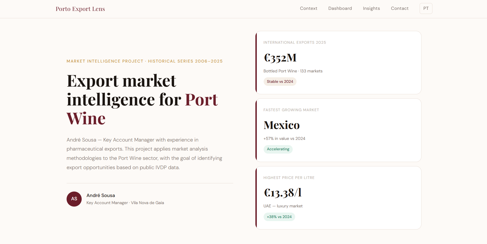
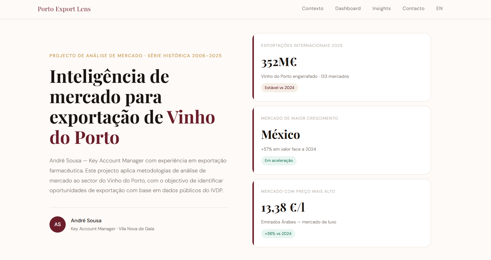

# Porto Export Lens — Port Wine Export Market Analysis 2006 - 2025

> A market intelligence tool built on public IVDP data to identify Port Wine export opportunities — framed from the perspective of a Key Account Manager.

## Language / Idioma

- [English version](#english)
- [Versão em Português](#portugues)

---

<a name="english"></a>

# English

[→ View dashboard](https://andrepocassousa.github.io/porto-export-lens/index-en.html)



---

## The problem

Port Wine exporters make market decisions based on historical experience and commercial intuition. The data exists — the IVDP publishes detailed export statistics by destination country since 2006 — but it is rarely processed systematically.

A typical KAM cannot answer in 30 seconds:

> "Which market has grown the most in value per litre over the past 5 years?"

This project answers three questions a KAM asks in any strategy meeting:

1. **Where are the untapped opportunities?** — markets growing below the radar
2. **Which markets are accelerating?** — value change 2024 vs 2025
3. **Where does Port achieve the highest price per litre?** — premium positioning by market

---

## Key findings

### 🟢 South Korea — premium and accelerating
Grew **+200% in value since 2019**, maintaining an average price of **€9.66/litre** in 2025 — the third highest of all markets. The only country appearing simultaneously in the growth top and price top.

### 🟢 UAE — the world's most expensive market
At **€13.38/litre**, the UAE is where Port Wine commands the highest price — and growing **+38% in 2025**.

### 🟡 Mexico and Finland — strong growth from a low base
Mexico (**+57%**) and Finland (**+48%**) are the fastest-growing markets in 2025.

### 🔴 USA — premium but contracting
Average price of **€9.55/litre** but volume declining since 2019. Fell from first to third place in absolute value.

---

## Dataset

| Field | Detail |
|---|---|
| Source | IVDP — Instituto dos Vinhos do Douro e Porto |
| Period | 2006–2025 |
| Records | 2,461 (after cleaning) |
| Countries | 187 destination markets |
| Variables | Country, year, volume (litres), value (€), average price (€/litre) |
| Scope | Bottled Port Wine — excludes bulk and special categories |

---

## Tech stack

```text
Raw data (XLS/HTML)  →  Python + BeautifulSoup (ingestion & cleaning)  →  CSV
CSV                  →  DuckDB (SQL analysis)                           →  results
Results              →  Chart.js + HTML                                 →  dashboard
```

- **DuckDB** — analytical SQL queries directly on CSV files
- **Python / BeautifulSoup** — ingestion and cleaning
- **Chart.js** — dashboard visualisation
- **GitHub Pages** — deployment

No paid dependencies. No proprietary BI tools. Fully reproducible from the code in this repository.

---

## Repository structure

```text
porto-export-lens/
├── assets/
│   └── dashboard_preview.png
├── data/
│   ├── raw/
│   └── porto_exportacoes.csv
├── sql/
│   ├── 01_top15_markets.sql
│   ├── 02_accelerating_markets.sql
│   ├── 03_premium_markets.sql
│   └── 04_kpis_overview.sql
├── index.html
├── index-en.html
├── .gitignore
└── README.md
```

---

## Key SQL queries

### Top 15 markets by value in 2025

```sql
SELECT
    pais                              AS country,
    ROUND(euros / 1000000.0, 2)       AS million_eur,
    ROUND(litros / 1000000.0, 2)      AS million_litres,
    ROUND(euros_por_litro, 2)         AS price_per_litre
FROM porto_exportacoes
WHERE ano = 2025
  AND pais != 'Portugal'
  AND euros > 0
ORDER BY euros DESC
LIMIT 15;
```

---

## Limitations

- Covers bottled Port Wine only
- No import market share data by country
- Aggregate sector data only

---

## Next steps

- [ ] Integrate UN Comtrade API
- [ ] Add special category analysis
- [ ] Forecasting model with Prophet
- [ ] Automated market briefs via Claude API

---

## About

Project developed by **André Sousa**, Key Account Manager with experience in pharmaceutical exports.

The analytical framework — opportunity identification, buyer segmentation, value vs. volume analysis — is transferred directly from B2B export experience into the Port Wine sector.

Based in Vila Nova de Gaia, at the heart of the Port Wine lodges.

**LinkedIn:**  
https://www.linkedin.com/in/andrepocasousa/

---

<a name="portugues"></a>

# Português

[→ Ver dashboard](https://andrepocassousa.github.io/porto-export-lens/index.html)



---

## O problema

As exportadoras de Vinho do Porto tomam decisões de mercado com base em experiência histórica e intuição comercial.

Os dados existem — o IVDP publica estatísticas detalhadas de exportação por país de destino desde 2006 — mas raramente são trabalhados de forma sistemática.

Um KAM típico não consegue responder em 30 segundos:

> "Qual é o mercado que mais cresce em valor por litro nos últimos 5 anos?"

Este projecto responde a três perguntas essenciais numa reunião estratégica:

1. **Onde estão as oportunidades escondidas?**
2. **Que mercados estão a acelerar?**
3. **Onde o Vinho do Porto consegue maior preço por litro?**

---

## Principais conclusões

### 🟢 Coreia do Sul — premium e em aceleração
Cresceu **+200% em valor desde 2019**, mantendo um preço médio de **€9.66/litro** em 2025.

### 🟢 EAU — o mercado mais caro do mundo
Com **€13.38/litro**, os Emirados Árabes Unidos são o mercado mais premium do Vinho do Porto.

### 🟡 México e Finlândia — forte crescimento a partir de base baixa
México (**+57%**) e Finlândia (**+48%**) lideram o crescimento em 2025.

### 🔴 EUA — premium mas em contração
Preço médio elevado mas perda consistente de volume desde 2019.

---

## Dataset

| Campo | Detalhe |
|---|---|
| Fonte | IVDP — Instituto dos Vinhos do Douro e Porto |
| Período | 2006–2025 |
| Registos | 2.461 (após limpeza) |
| Países | 187 mercados |
| Variáveis | País, ano, volume, valor, preço médio |
| Âmbito | Apenas Vinho do Porto engarrafado |

---

## Stack tecnológica

```text
Dados brutos (XLS/HTML) → Python + BeautifulSoup → CSV
CSV                     → DuckDB (SQL)           → resultados
Resultados              → Chart.js + HTML        → dashboard
```

- **DuckDB** — análise SQL sobre CSV local
- **Python / BeautifulSoup** — ingestão e limpeza
- **Chart.js** — visualização
- **GitHub Pages** — publicação

Sem dependências pagas. Sem ferramentas proprietárias.

---

## Estrutura do repositório

```text
porto-export-lens/
├── assets/
│   └── dashboard_preview.png
├── data/
│   ├── raw/
│   └── porto_exportacoes.csv
├── sql/
│   ├── 01_top15_markets.sql
│   ├── 02_accelerating_markets.sql
│   ├── 03_premium_markets.sql
│   └── 04_kpis_overview.sql
├── index.html
├── index-en.html
├── .gitignore
└── README.md
```


## SQL queries 

### Top 15 mercado em valor em 2025

```sql
SELECT
    pais                              AS country,
    ROUND(euros / 1000000.0, 2)       AS million_eur,
    ROUND(litros / 1000000.0, 2)      AS million_litres,
    ROUND(euros_por_litro, 2)         AS price_per_litre
FROM porto_exportacoes
WHERE ano = 2025
  AND pais != 'Portugal'
  AND euros > 0
ORDER BY euros DESC
LIMIT 15;
```

---

## Limitações

- Apenas Vinho do Porto engarrafado
- Sem quota de mercado por país
- Dados agregados sectoriais

---

## Próximos passos

- [ ] Integração com API UN Comtrade
- [ ] Categorias especiais (LBV, Tawny, Vintage)
- [ ] Forecasting com Prophet
- [ ] Briefings automáticos via Claude API

---

## Sobre

Projecto desenvolvido por **André Sousa**, Key Account Manager com experiência em exportação farmacêutica.

A metodologia de análise de mercado — identificação de oportunidades, segmentação de compradores e análise valor vs. volume — é aplicada ao contexto do Vinho do Porto.

Baseado em Vila Nova de Gaia, no coração das caves do Porto.

**LinkedIn:**  
https://www.linkedin.com/in/andrepocasousa/

---

*Dados: IVDP — Instituto dos Vinhos do Douro e Porto. Série 2006–2025.*
